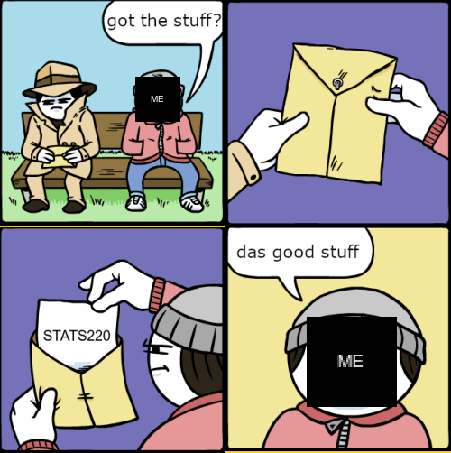

# Hello Trespasser

This is my meme that I made using the [{magick}](https://cran.r-project.org/web/packages/magick/vignettes/intro.html).



## Inspiration
I found this meme [{here}](https://knowyourmeme.com/memes/das-good-shit)

I made this meme because I had already used this format to make a meme when I was in **high school**.
I found it easy to find and adapt for my own purposes. 

### The Steps I Took to Make This Meme

1. I first added image_blanks on the man's face to represent me
2. Then I read in each panel using image_read.
3. Then I replaced the man's face in panel 1 and 3 with the image blank to represent me
4. Then I added the text to the third panel that said "Stats 220"
5. Then I combined the first two panels into row 1 and the last 2 panels into row 2
6. Finally, I combined the two rows and wrote the image to my hard-drive

**I got rid of the swears too!**

### Reasons why this meme is original
- This meme shows a man trying to the good stuff, which is the *STATS220 course* 
- I used new characters (Me) 
- I also made a new thing that the man takes out of the envelope.


## The R Code I Used
```
library(magick)

me <- image_blank(50, 50, color="#000000") %>%
  image_annotate("ME", gravity="center", color="#FFFFFF")

panel_1 <- image_read("memecomponents/1.png") %>%
  image_scale(250)

panel_1_combined <- image_composite(panel_1, me, offset= "+150+85")


panel_2 <- image_read("memecomponents/2.png") %>%
  image_scale(250)

panel_3 <- image_read("memecomponents/3.png") %>%
  image_annotate("STATS220", location = "+60+140", size=20) %>%
  image_scale(250)

panel_4 <- image_read("memecomponents/4.png") %>%
  image_scale(250)

panel_4_combined <- image_composite(panel_4, image_scale(me, "x100"), offset="+90+100")

first_row <- c(panel_1_combined, panel_2) %>% 
  image_append()

second_row <- c(panel_3, panel_4_combined) %>%
  image_append()

meme <- c(first_row, second_row) %>%
  image_append(stack = TRUE)
  
  meme

image_write(meme, "my_meme.png")
```
